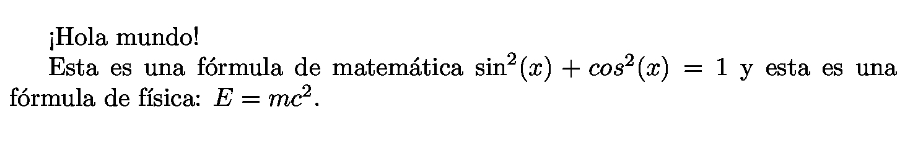

*NOTA:* Para descargar los posters en formato =*.jpg= o =*.pdf=. Visitar la sección **Releases**: https://github.com/rodrigo-morales-1/posters-uni-peru/releases

*NOTA:* A esta fecha (2026-05-31), solo 1 poster está terminado.

* Introducción

Este repositorio contiene posters que listan fórmulas y expresiones que son comúnmente usadas en los cursos de ciencias del CEPREUNI y en los cursos generales de los primeros ciclos de la Universidad Nacional de Ingeniería. El objetivo de estos posters es ayudar a los estudiantes recordar las fórmulas que suelen ser relevantes al resolver ejercicios.

Al brindar el código fuente de los posters, cada estudiante tiene la libertad de modificar los posters según lo consideren necesario. Por ejemplo, pueden cambiar los colores usados en los gráficos, cambiar el espaciado entre líneas, eliminar/añadir formulas o secciones, etc.

* ¿Cómo contribuir?

2 maneras:

1. Reporta algún error en algún poster o sugiere una mejora creando un *issue* en este repositorio
   + Para hacer esto, necesitas crear una cuenta de Github. Luego de crear la cuenta, visitar [[https://github.com/rodrigo-morales-1/posters-uni-peru][este repositorio]], ir a la ventana *Issues* y presionar en "*New Issue*"
   + Hacer esto es similar a crear una publicación en un foro de Internet
2. Crear *pull requests*
   + Para hacer esto, necesitas tener conocimientos del comando =git= y como hacer un *pull request*. Además, necesitas conocer lo básico de LaTeX.

* ¿Qué es LaTeX?

LaTeX es un [[https://www.wikidata.org/wiki/Special:GoToLinkedPage/eswiki/Q37045][lenguaje de marcado]] que se suele utilizar para escribir documentos que tienen fórmulas de matemática, química o física.

El bloque de abajo muestra un archivo de texto con la extensión =*.tex=. Nostros al pasarle ese archivo a LaTeX, generaremos un archivo PDF que muestra el texto =¡Hola mundo!=.

#+BEGIN_SRC tex
\documentclass{article}

\begin{document}
¡Hola mundo!

Esta es una fórmula de matemática $\sin^2(x) + cos^2(x) = 1$ y esta es una fórmula de física: $E = mc^2$.
\end{document}
#+END_SRC

Si aprendes a editar LaTeX, podrás modificar los posters de este repositorio a tu gusto (ejm, cambiar colores, eliminar secciones, etc.)

Para convertir un archivo =*.tex= (extensión de documentos de LaTeX) a un archivo =*.pdf=, es necesario tener instalado un compilador de LaTeX. Una alternativa a instalar un compilador que es más accesible para principiantes es usar un compilador online en tu navegador web (ejm. [[https://es.overleaf.com/][Overleaf]]).

* Licencia

El código de este repositorio ha sido dedicado al dominio público bajo la licencia CC0 1.0 Universal. Cualquier persona puede copiar, modificar, distribuir e interpretar la obra, incluso para propósitos comerciales, sin pedir permiso. Más información en: https://creativecommons.org/publicdomain/zero/1.0/deed.es
